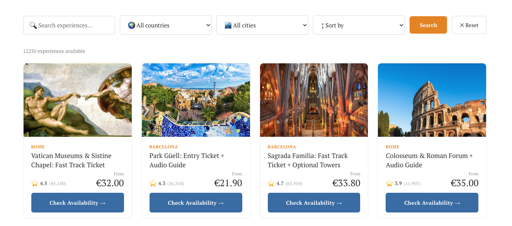
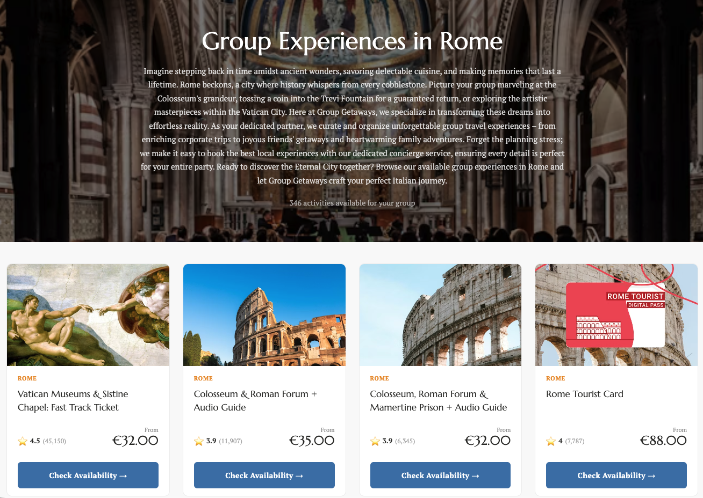
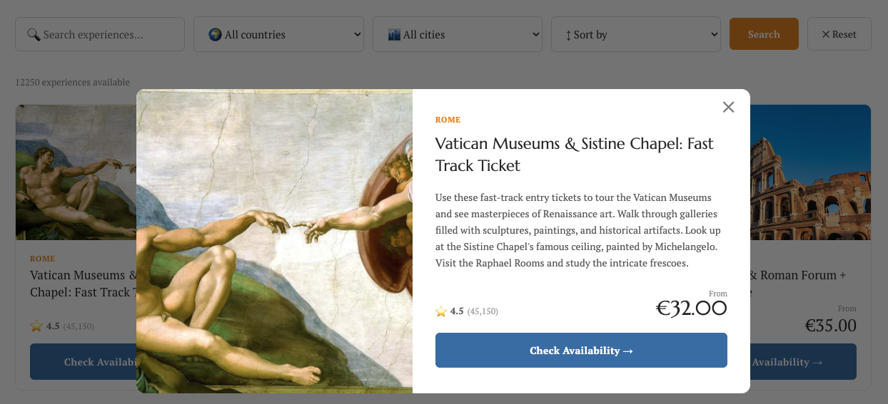

# Travel Experiences Platform

A travel experiences distribution platform built to automate product import, content generation, and static page publishing at scale.

## Overview

This project was created to manage and publish a large catalog of travel experiences using automation and lightweight infrastructure.

It connects product data import, spreadsheet operations, static JSON generation, and city-based page publishing into one workflow.

## What it does

- Imports experience data from an external API
- Stores and manages product data in Google Sheets
- Pushes structured JSON to GitHub
- Generates static city pages automatically
- Serves content through Cloudflare
- Supports a frontend widget for filtering and browsing experiences

## Stack

- Google Apps Script
- Google Sheets
- GitHub
- Cloudflare
- JavaScript
- HTML/CSS
- External API integrations
- Gemini API

## Repository Structure

```
md
The repository is organized into two main layers: backend automation in Google Apps Script and frontend presentation for the embeddable experience widget.

bash
travel-experiences-platform/
├── apps-script/
│   └── main.gs            # Google Apps Script backend: supplier sync, image enrichment, cache layer, JSON API
├── frontend/
│   └── widget.html        # Frontend widget with filters, pagination, modal, and URL state
├── README.md              # Project overview, architecture, setup notes, and screenshots
├── screenshot-city-page.png
├── screenshot-platform.png
└── screenshot-product-popup.png

Folder overview
	•	apps-script/ — Handles product import from supplier API, spreadsheet sync, progress tracking, image enrichment, caching, and JSON output.
	•	frontend/ — Contains the embeddable marketplace widget used on the website.
	•	screenshots — Visual proof of the product listing UI, city landing pages, and product popup experience.
```

## Results

- 12500+ experiences imported
- 1300+ product pages generated
- Automated content publishing workflow
- Search-friendly static city pages
- Lightweight and scalable infrastructure

## Status

This repository is a sanitized portfolio version of a real-world project. Sensitive credentials, tokens, and internal business logic have been removed.

## Screenshots

### Product listing


### City page


### Product popup


